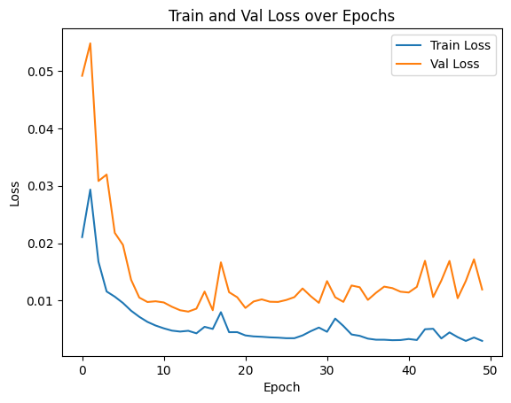
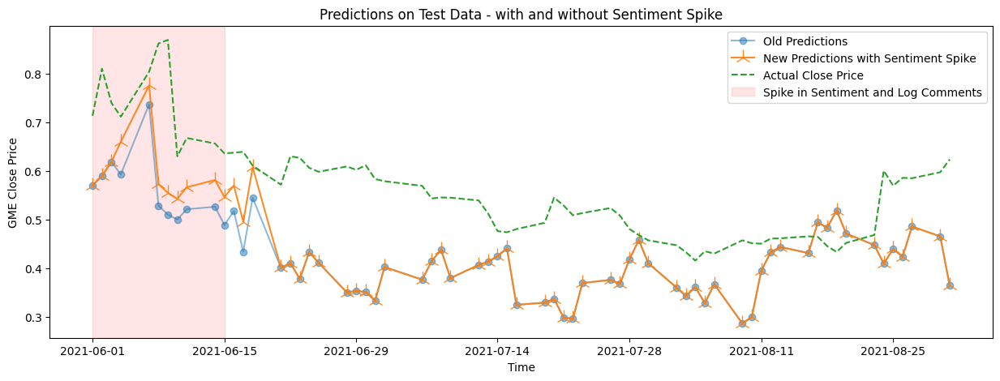

# GameStop Stock Price Prediction with LSTM and Sentiment Analysis

This project investigates the dynamics of GameStop stock prices during the short squeeze of January 2021, driven by retail investors on social media platforms. The study aims to predict GameStop’s stock price using an LSTM model and assesses whether incorporating sentiment data from Reddit can improve prediction accuracy.

## Overview

- **Objective**: To forecast GameStop stock prices using historical financial data and sentiment analysis from social media.
- **Key Event**: The GameStop short squeeze, which caused a surge in stock prices and significant market disruption, serves as the case study.
- **Data Sources**:
  - Financial data from Yahoo Finance API (January 2020 to August 2021).
  - Reddit discussion data (entire 2021) gathered from relevant subreddits.

## Methodology

1. **Data Collection**:
   - Stock closing prices and trading volumes were retrieved for all NYSE-listed companies.
   - A subset of 20 stocks highly correlated with GameStop was selected for inclusion in the model.
   - Sentiment data was extracted from Reddit posts using TextBlob, focusing on comment volume and daily sentiment.

2. **Model Development**:
   - A Long Short-Term Memory (LSTM) model was built using PyTorch.
   - Min-max scaling was applied to normalize the data.
   - The dataset was split into training, validation, and test sets, with the test set covering the critical period from June 2021 to August 2021.

3. **Evaluation**:
   - The model was evaluated using Mean Squared Error (MSE).
   - A comparison between models with and without sentiment data was conducted.

## Results

### Training and Validation Loss Over Epochs

### Test Set Predictions

- The model showed moderate accuracy in predicting stock prices.
- Incorporating sentiment data slightly improved performance, but the enhancements were not significant.
- Sensitivity analysis revealed that sentiment-driven price fluctuations had a transient effect on stock prices.

## Discussion

The project highlights the complexity of stock price prediction in volatile markets influenced by social media. While sentiment analysis provides valuable insights, more robust feature engineering and larger datasets are needed for substantial improvements. Additionally, ethical concerns regarding the use of social media data in financial models are discussed.

## Future Work

- Explore alternative neural network architectures.
- Improve sentiment feature extraction and engineering.
- Investigate long-term stock price prediction rather than focusing solely on short-term events.
- Address ethical implications of sentiment-driven financial forecasting.

## Author

- **Mengtao Zhao**

## References

- Financial data: Yahoo Finance API
- Sentiment analysis: Reddit discussion data

## Technical Resources

- YouTube videos on LSTM forecasting

